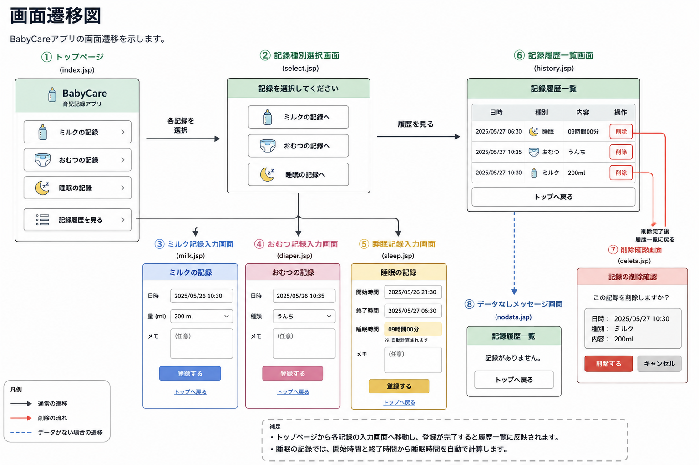
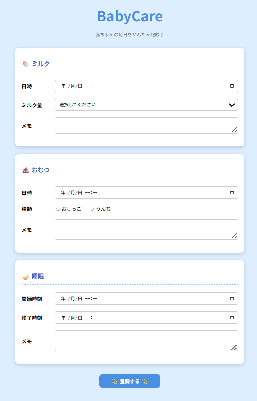
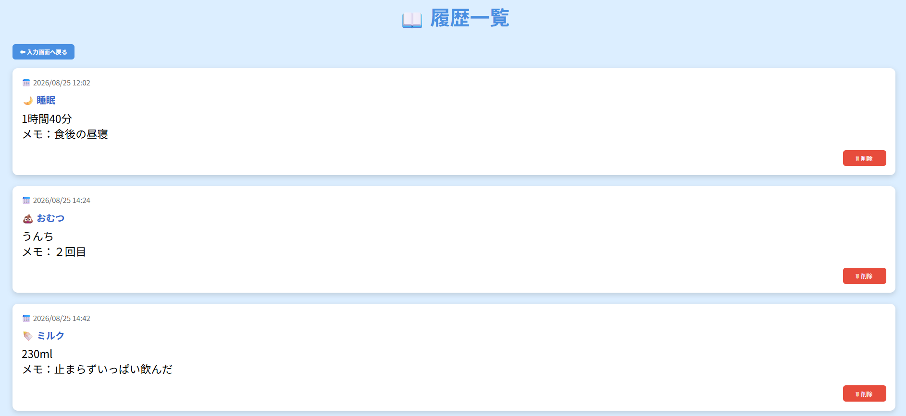

# ベビーケアアプリ

赤ちゃんのミルク・おむつ・睡眠を記録するWebアプリです。

## 概要

赤ちゃんの日々の記録を簡単に入力・管理できるアプリです。

以下の記録に対応しています。

- 🍼 ミルク記録
- 💩 おむつ記録
- 🌙 睡眠記録
- 📖 履歴一覧
- 🗑️ 履歴削除

記録した内容は履歴一覧で確認できます。

## 主な機能

- ミルクの記録
- おむつの記録
- 睡眠時間の記録・自動計算
- 記録履歴の一覧表示
- 記録の削除
- データがない場合のメッセージ表示

## 画面遷移図

### 記録入力画面

ミルク・おむつ・睡眠の記録を1画面から入力できます。

### 履歴一覧画面

登録した記録を時系列で確認でき、不要な記録を削除できます。 
睡眠記録では、開始時刻と終了時刻から睡眠時間を自動計算します。

## 使用技術

- 言語：Java
- フレームワーク：なし
- Web技術：Servlet / JSP / JSTL / EL式
- サーバー：Apache Tomcat
- バージョン管理：Git / GitHub

## 開発環境

- Eclipse
- Java
- Apache Tomcat

## 制作目的

Java・Servlet・JSPなどの学習成果を活かし、実際の利用場面を想定したWebアプリケーションの開発を目的として制作しました。

日々の育児で発生するミルク・おむつ・睡眠などの記録を簡単に登録・確認できるようにし、育児中の記録管理をサポートするアプリケーションを目指しました。

また、ServletやJSPを用いた画面処理やMVCモデルを意識した設計など、Webアプリケーション開発の基本的な流れを実践することを目的としています。

## 今後の実装予定

現在はJava・Servlet・JSPを中心に実装しています。
今後はデータベースの学習内容を活かし、以下の機能を追加する予定です。

- データベースとの連携
- 記録データの永続化
- 記録の編集機能
- 日ごとのトータルデータ表示
- 入力内容のバリデーション強化
- ログイン機能
- ユーザーごとの記録管理
